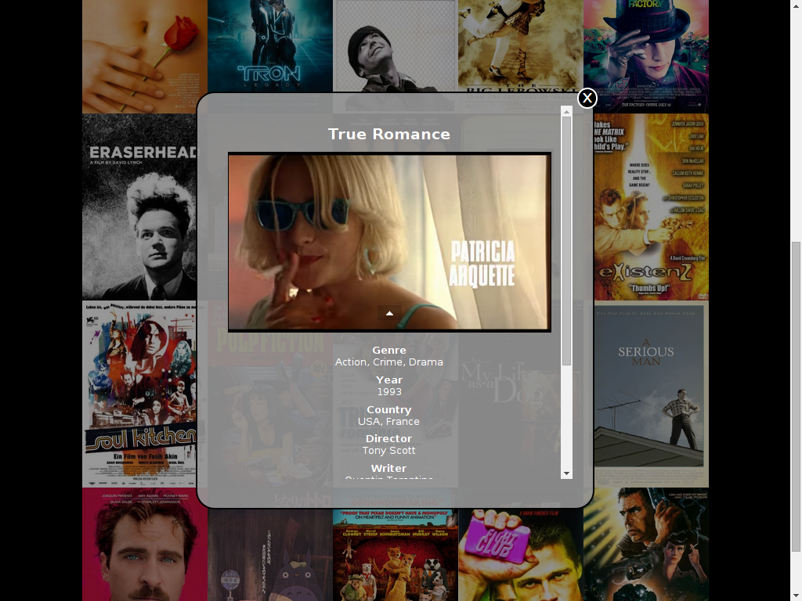

# Movie Trailer Website

## About
This is an implementation of the first project within
[Udacity](https://www.udacity.com/)'s [Full Stack Web
Devloper Nanodegree](https://www.udacity.com/course/nd004). It represents
server-side code to store movies and generate a web page representation of
these.

## Useage
Running `generate.py` with your favourite _Python 3_ implementation
generates `index.html`. Opening it with a browser displays posters of
different movies. Hovering over a poster shows title and basic information
about a movie. Upon clicking, a modal is opened containing an embedded video
of the movie's trailer as well as detailed data.

Tested with CPython 3.4.2, Chromium 40 as well as Firefox 35.

## Showcase

[Demo](http://pesser.github.io/tiles/)

## Customization
`generate.py` contains a list of movie names. For each of the movies it will
try to obtain information from the [OMDb API](http://omdbapi.com/) as well
as from [YouTube](https://www.youtube.com/). If informations can not be
obtained, the movie will be ignored. However, to avoid excessive data
requests, the movies' data is stored on disc in json format, which allows
you to manually insert data. Similiarly, the movies' posters are retrieved
and stored in the folder `posters`, since [IMDb](http://www.imdb.com/) does
not allow hotlinking. A sample of a movie list, movie data and movie posters
is included but feel free to remove `movie_cache.json`, `posters` and change
the list of movie names.

Some design aspects of the generated web page can be adjusted through the
methods of the `TilingTemplate` instance, in particular the width of the
container holding the posters and the number of posters per row to display.
